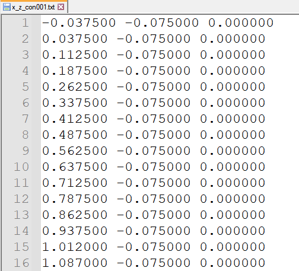
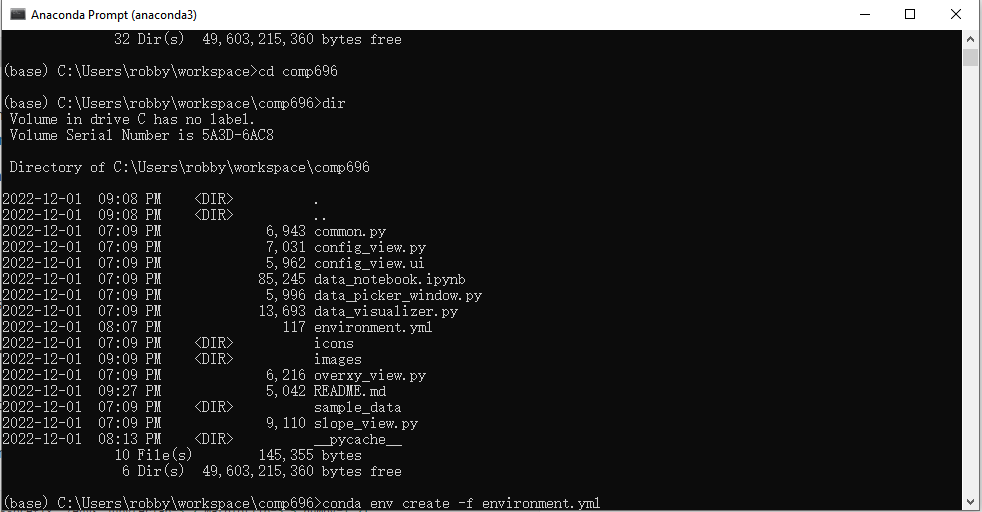
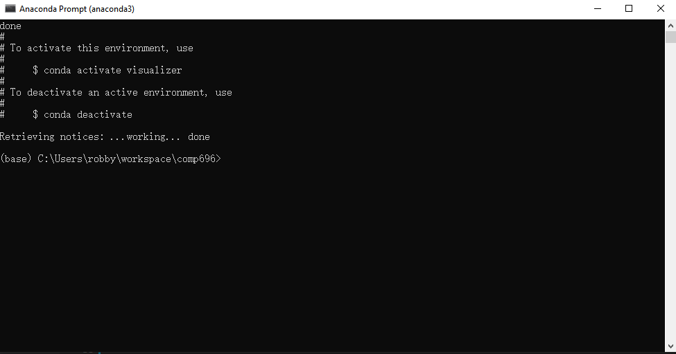
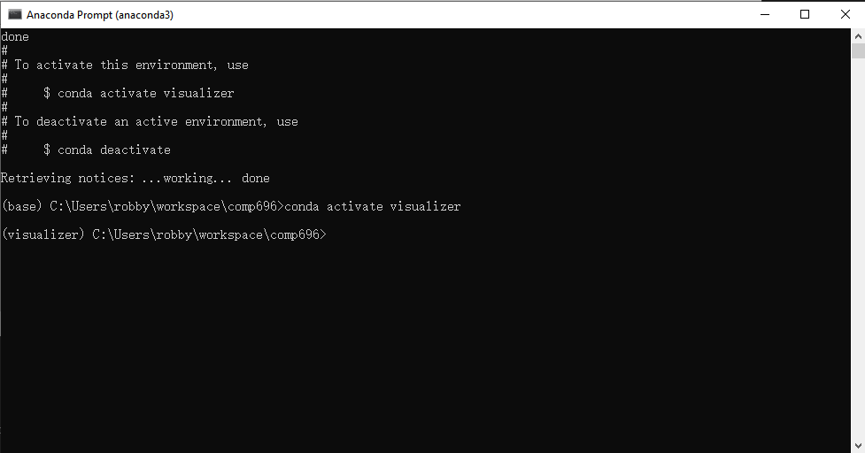
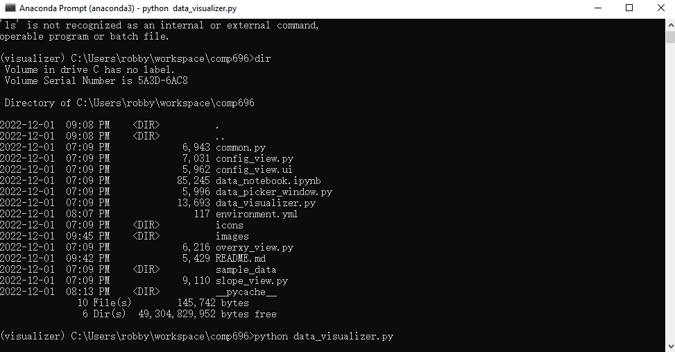
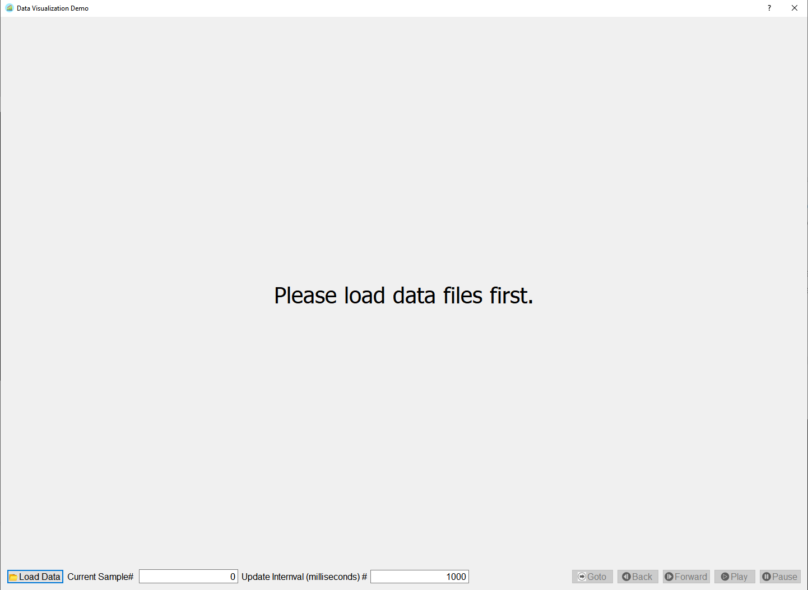

# Data Visualizer

Data Visualizer is a desktop software to visualize scientific data which has measurement data in two or more dimensions over time. The software offers the capability to graphically view the measurement change in a two-dimension space as well an extra view over time. 

The software is developed using Python-based technology stack, namely Python3, Pandas and Matplot.

## Background

In scientific research, such as convection-diffusion studies for heat transmission, smoke concentration changes, or wildfire spread, partial differential equations are broadly used to model scenarios. Those numeric data points are usually collected or extrapolated, representing spatial or temporal information. It is very challenging to extract insights from the data without using visualization. Researchers typically rely on off-the-shelf software or write their code to call visualization libraries to comprehend the knowledge buried in the data.

A research effort was undertaken to look for any software or programming libraries with minimum coding to visualize such data. After evaluation of 17 tools and 23 libraries, it was decided to custom build our own software, primarily due the reasons below:

* license cost with commerical software even the software could have the features needed.
* Off-the-shelf software do not have the exact the features required. For example, we want to two data visualization to be correlated and none of the software has it.
* Coding with libraries under GUIs such as Jupyter does have not good support to implement mouse and keyboard events. 
* Luck of skills to use and evalaute some JavaScript-base technologies.

##### Software evaluated:
* [Tableau](https://www.tableau.com/)
* [Gephi](https://gephi.org/)
* [Bokeh Server](https://docs.bokeh.org/)
* [iChart](https://dev.quantumcloud.com/ichart/)
* [IngoGram](https://infogram.com/)
* [ChartBlocks](https://www.chartblocks.io/)
* [DataWrapper](https://www.datawrapper.de/)
* [Grafana](https://grafana.com/grafana/)
* [Orange](https://orangedatamining.com/home/interactive_data_visualization/)
* [Kibana](https://www.elastic.co/kibana/)
* [Power BI](https://powerbi.microsoft.com/en-au/)
* [Plotly (Dash)](https://plotly.com/)
* [RAW Graphs](https://www.rawgraphs.io/about)
* [Visualize Free](https://www.visualizefree.com/)
* [ParaView](https://www.paraview.org/)
* [VisIt](https://github.com/visit-dav/visit)
* [PyVT](https://github.com/lvyu-imech/PyVT)


##### Programming libraries evaluated:
* [Altair](https://altair-viz.github.io/)
* [Biojs](https://github.com/biojs/biojs)
* [Bokeh](https://bokeh.org/)
* [Chartist.js](https://gionkunz.github.io)
* [Charts.js](https://www.chartjs.org/)
* [D3.js](https://d3js.org/)
* [Echarts](https://echarts.apache.org/)
* [Fusioncharts](https://www.fusioncharts.com/)
* [ggplot](https://ggplot2.tidyverse.org)
* [Google charts](https://developers.google.com/chart/i)
* [Graphviz](https://graphviz.org/)
* [Highchartsjs](https://www.highcharts.com/)
* [Jfreecharts](https://www.jfree.org/)
* [JGraphx](https://github.com/jgraph/jgraphx)
* [Jung](https://jrtom.github.io/jung/)
* [Lattice](https://jtr13.github.io/cc21fall1/introduction-to-the-lattice-package.html)
* [Leaflet](https://github.com/Leaflet/Leaflet)
* [Matplotlib](https://matplotlib.org/)
* [Plotly](https://plotly.com/python/)
* [PyQtgraph](https://www.pyqtgraph.org/)
* [Seaborn](https://github.com/mwaskom/seaborn)
* [Sigma.js](https://www.sigmajs.org/)
* [Zingcharts](https://github.com/zingchart/ZingChart)
* [Lightning](https://github.com/lightning-viz/lightning)
  

### Data File Format Requirements

A sample data has been included in the repo, located at the [sample_data](./sample_data). Inside the directory, there are multiple files with the identical layout, with each one representing the data of a point of time. 

Below is an example of the data file. All fields must be numerical and there must be at least 3 fields, separated by spaces. This data requirement can easily be modified or enriched but for the time being, this is what it is.




### Get Started

In order to run the program, Python 3 environment and some libraries must be installed. Although there are multiple Python environments, it is recommended to use Anaconda environment which is broadly used in Python development and data science communities. 

1. To install Anaconda, just follow its instruction at https://www.anaconda.com/. This software is supposedly platform independent but please keep in mind the devlopment and unit test so far have been only done on Windows 10 platform. In addition, please be sure to choose Python 3 and not Python 2.x as some features might not be well supported.
<br>
2. Once Anaconda is installed. Use the [environment.yml](environment.yml) file to restore the virtual environment with all the required libraries to run the program. Clone this repo, open up an Anaconda Prompt window, navigate to the cloned repo directory and run the command below to create a virtual environment named as "visualizer". 
   
    ```bash
    conda env create -f environment.yml
    ```

    


3. Once the environment is restored, the Anaconda Prompt window should notify the user that the environment is ready for use, like the screenshot below.

    


4. Activate the virtual environment by the command below.

    ```bash
    conda activate visualizer
    ```

    

5. Launch the Visualizer program by running Python with the entry source code file.
   
    ```bash
    python data_visualizer.py
    ```
    


6. If the program can be successfully launched, the following main screen should show up.
   
    

### User Instruction
Pending...

### Development Guide
Pending...